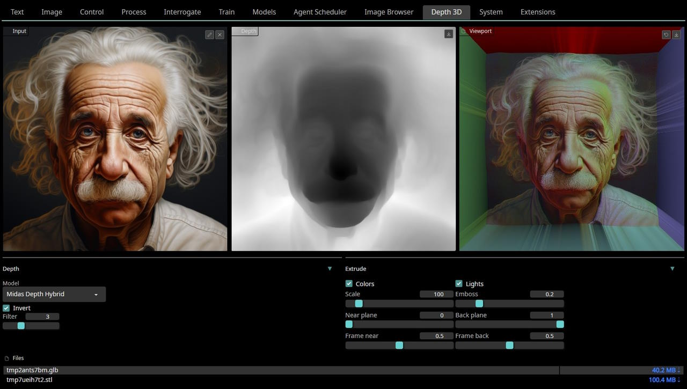

# Image to 3D scene

### An extension for [SD.Next](https://github.com/vladmandic/automatic)

## Usage

Select any input image and depth-map model to process it  
 *or*  
Select depth-map image as input directly  

Output can be viewed interactively in the UI or downloaded as GLB or STL scene files  

## Screenshot

